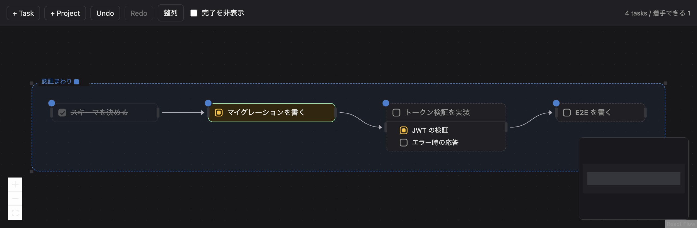

# taskdag

> 実装作業を、リストではなくグラフとして。

taskdag は、エンジニアが日々こなす細かい実装作業のための、ローカル完結型のタスク管理ツールです。

作業をグラフとして描くと、今どれに着手できるかをグラフが教えてくれます。



左から順に、完了・着手中・着手待ち・着手待ち。**枠線が実線なら今すぐ着手できる**、というのが
唯一の読み方です。画面は開発中のもので、これから変わります。

## 解こうとしている問題

ある機能に取りかかるとき、頭の中ではこういうことが起きています。

```
    調査 ──→ スキーマを決める ──→ マイグレーションを書く
                                        │
                                        ↓
                              Entity ──→ Repository ──→ Service
                                              │
                                              ↓
                                            テスト
```

順番があり、いくつかは前が終わらないと本当に始められません。こうした手順はチケットに残さず、
別の方法で扱うことがあります。チケットより下の層です。

調査した範囲では、この層は各自が自前の仕組みで抱えていました —— プレーンテキスト、リポジトリ内の
markdown、org-mode、コード内の TODO コメント。特定のツールが選ばれているのではなく、人によって
ばらばらです。

ここから先は仮説です。そうした自前の仕組みはたいていリストの形をしていて、上の図のような
順序をそのまま持てません。すると順序は本人の頭の中に残り、「今どれができるのか」はそのつど
思い出すことになる。中断して戻ってきたときには、それを組み立て直すことになる —— というのが
taskdag が前提にしている困りごとです。

この困りごとが広く共有されているという証拠は、まだありません。調査で確かめられたのは
「この層に定番の道具がなく、各自が自前でやっている」ところまでです(`research/` 参照)。

taskdag が試しているのは、この構造をそのまま描けるようにすることです。順序を矢印として
描いておけば、「今どれに着手できるか」は覚えておくものではなく、画面を見れば分かるものに
なります。同じ困りごとに心当たりがあれば、試してみてください。

## なぜ既存のツールではないのか

既存のツールが悪いという話ではありません。探していた組み合わせが見つからなかった、という
話です。以下は調査した範囲(`research/` に出典あり)についてのもので、市場全体の断定では
ありません。

タスク管理ツール(Todoist、Things 3、TickTick、Microsoft To Do、OmniFocus、Jira、Linear、
GitHub Projects)には、依存関係を絵として見る手段が見当たりませんでした。関係を登録できる
ものはあります。GitHub Issues では「これがこれをブロックしている」という登録から状態が自動で
決まり、仕組みとしては taskdag と同じです。ただしそれは一覧のバッジとして読むもので、
全体がどう繋がっているかは見えません。

キャンバス系ツール(Miro、tldraw、Excalidraw、FigJam、Obsidian Canvas、Heptabase、
Workflowy、Logseq)では、矢印を引けますが、そこから状態が計算される仕組みは見つかりません
でした。図として関係を表す用途には十分機能します。用途が違う、というだけのことです。

片方は依存のデータを持つが絵がない。もう片方は絵を持つが計算しない。taskdag が試している
のはその組み合わせです —— 自分で編集するグラフがあり、Ready と Blocked はそのグラフから
計算される。手で管理することはありません。

## どう使うものか

チケット管理を置き換えるものではありません。Jira や GitHub Issues でチケットを持っている
なら、それはそのままで構いません。taskdag が扱うのは、そのチケット1枚を実際どう進めるかの
ほうです。粒度を分けて使うことを想定していますが、実際に二重管理にならずに済むかは、
使ってみて確かめる必要があります。

想定しているのは、1件の作業に取りかかるときに開いて、終わったら畳むという使い方です。
数十件のタスクが同時に画面にある状態を想定しており、それ以上に育てることは考えていません。

なお、これは別のアプリを開くという選択でもあります。調査では「汎用のノートアプリへ
切り替えるとフロー状態が壊れる」という報告があり、その懸念はこの製品にも当てはまります。
だからこそ、開いている間は**見て分かる**ことに寄せています —— 何かを入力しに行くのではなく、
隣に開いたまま状況が読めるものとして。ここが機能しなければ、この製品を選ぶ理由はありません。

## 使い方

配布ビルドはまだありません。動かすには、下の「開発」と同じ手順が要ります。

```bash
nvm use              # Node 24
npm install
npm run dev
```

### ひととおりの流れ

1. **`+ Task`** を押すと Task ができ、名前の入力にフォーカスが移ります。そのまま打てます。
2. 名前を打っている途中で **Shift+Enter** を押すと、名前が確定して childTask が1件足され、
   その入力に移ります。続けて押せば、手を止めずに分解を書き出せます。
3. **Enter** で確定して編集を抜けます。行き過ぎたら、空の childTask 名で **Backspace** を
   押すとその1件が消えて、1つ上の名前に戻ります。
4. 先に終わらせる Task の**右**の丸から、後にやる Task の**左**の丸へドラッグすると、
   依存の矢印が引けます。`A → B` は「A が終わるまで B は始められない」という意味です。
   循環になる引き方はできません。
5. 依存が残っている Task は枠線が点線になり、沈んで見えます。先行する Task を完了にすると、
   その場で実線に変わります。この Ready / Blocked は自動で決まるもので、直接は変えられません。

### 操作の一覧

| したいこと | 操作 |
|---|---|
| Task / Project を作る | ツールバーの `+ Task` / `+ Project` |
| 名前を変える | 名前をクリック(1回)。または選んで **F2** |
| 名前を確定する | **Enter** |
| childTask を足す | 名前の編集中に **Shift+Enter**、または Task の **＋** |
| childTask を消す | 名前が空のときに **Backspace**、または **×** |
| childTask を並べ替える | 行の左端の取っ手をドラッグ。**↑** / **↓** でも動かせます |
| childTask を別の Task へ移す | 取っ手を掴んで、相手の Task の上へ運ぶ |
| childTask を独立した Task にする | 取っ手を掴んで、何もない場所へ落とす |
| Task を別の Task の手順にする | Task を掴んで、相手の見出しか手順の並びの上へ運ぶ |
| childTask を隠す | **▾** で折りたたみ。**▸ 3** のように件数が残ります |
| メモを書く | 名前の編集中に **Tab**、または **✎** |
| Task を動かす | 見出しの左端の取っ手をドラッグ |
| 依存を引く | 先に終わらせる Task の**右**の丸から、後にやる Task の**左**の丸へドラッグ |
| 依存を外す | 矢印に触れると **×** が出るので押す |
| 状態を進める | 左の四角を押す。未着手 → 着手中 → 完了 → 未着手 |
| Task を削除する | Task の **×**。何が消えて何が繋ぎ直されるかを先に確認できます |
| まとめて並べ直す | ツールバーの **整列** |
| 完了したものを隠す | ツールバーの **完了を非表示** |
| 取り消す / やり直す | **Cmd+Z** / **Cmd+Shift+Z**(Windows・Linux は Ctrl) |
| 画面を動かす | スクロール。拡大縮小はピンチ、または **Cmd** + スクロール |
| 全体を表示する | 左下の枠のアイコン |

**入れ替えは確認を挟みません。** 運んでいる間、掴んでいるものが影として出て、入る場所に線が
引かれます。離した時点で確定し、間違えたら **Cmd+Z** で戻ります。Task を別の Task の手順に
すると、その Task が持っていた依存は新しい親へ付け替わります（`X → T` は `X → A` に）。
逆に手順を独立させたときは、依存を引き継ぎません。

**Delete キーでは Task は消えません。** 依存の矢印まで黙って消えるためです。削除は **×** から
行い、消える依存と繋ぎ直される依存を確認したうえで実行します。

### Project(枠)

`+ Project` を押すと枠が現れます。**所属は、Task がその枠の中にあるかどうかだけで決まります。**
タグを付ける操作はありません。枠に入れば付き、外へ出せば外れます。

- 枠は内側のどこを掴んでも動かせます。中の Task も一緒に来ます。
- 辺や角をつまむと大きさを変えられます。
- 枠どうしは重ねられません。重なる位置へ運んでいる間は枠線が赤くなり、離すと元に戻ります。
- 名前をクリックすると改名、四角の見本を押すと色を変えられます。
- 枠を消しても、中の Task は消えません。所属が外れるだけです。

## 動作環境とデータ

- macOS / Windows / Linux(Electron アプリ)。ただし現時点で配布ビルドはなく、ソースから
  動かす必要があります。
- データはすべてローカルの SQLite ファイル1つに入ります。場所は Electron の
  ユーザーデータ領域(macOS なら `~/Library/Application Support/` の下)です。
- **バックアップは自分で取ってください。** クラウド同期はなく、ファイルが壊れれば復旧手段は
  ありません。
  - **アプリ内にバックアップ機能はまだありません**(`requirements.md` FR-9 は未実装)。
    手で取る場合は、**アプリを終了してから** `taskdag.db` と `taskdag.db-wal` を一緒に
    コピーしてください。起動したまま `taskdag.db` だけを複製すると、直近の変更が
    入らないことがあります(WAL を使っているため)。
- 単一の端末での利用を前提にしています。同じファイルを複数の端末で共有する想定はありません。

## 中心となる考え方

- Task は作業の単位で、childTask をチェックリストとして持てます。深さは1まで。
- 依存エッジはトップレベルの Task 同士を結びます。`A → B` は「A が終わるまで B は
  始められない」という意味です。
- Ready / Blocked はその関係から導出されます。設定はできません。
- 未着手 / 着手中 / 完了 は別の軸で、作業した本人が設定します。
- Project はキャンバス上の領域で、Task の所属は位置から導出されます。保存しません。

2軸が独立しているので、「Blocked かつ着手中」という状態が成立します。ブロックが外れる前に
下準備をしている状況です。

## 設計原則

1. グラフを編集する体験が中心にあります。フィールドを埋めることではありません。
2. ツールが構造を押し付けません。導出された状態が編集を妨げることはありません。
3. Ready と Blocked は計算されます。ボトルネックと全体の流れは、計算ではなく
   見えることを狙っています。

## 現在の状態

**開発中で、まだリリースしていません。** キャンバスは動きます —— Task を作り、依存を引き、
Ready/Blocked が更新される様子を見られます。ただし手動での品質確認を通していないため、
粗い箇所があります。インストールできるビルドはまだありません。動かすには下記の「開発」を
参照してください。

| Phase | 範囲 | 状態 |
|---|---|---|
| 0 | 技術検証 — Electron + React Flow + SQLite | ✅ 完了 |
| 1 | ドメイン層(TDD、フレームワーク非依存) | ✅ 完了 |
| 2 | 永続化(SQLite) | ✅ 完了 |
| 3 | UI(React Flow のキャンバス) | ✅ 完了 |
| 4 | AI 操作のための MCP サーバー | 次 |
| 4 | バックアップの書き出し(FR-9) | 未着手。MCP と同時に判断 |

## やらないこと

後回しではなく、**設計として範囲外**のものです。

- チーム・複数ユーザーでの調整
- クラウド保存・同期 —— **データは完全にローカルに留まります**
- 外部チケット管理システム(Jira, GitHub Issues, Linear)との連携
- あなたの代わりにタスクを実行すること —— taskdag が扱うのはグラフの管理まで
- 分解の粒度を強制すること —— タスクの大きさは常にあなたが決めます

## AI からの操作

**まだ実装していません。Phase 4 で作ります。** 計画としては、MCP サーバーを通じて AI
コーディングツール(Claude Code など)がグラフを会話で管理できるようにするものです ——
「今なにが着手できる?」「認証のタスクを完了にして」「これはもう要らないから消して」——
その隣でキャンバスが生きたビューとして開いたまま更新される、という形を想定しています。

そのための構造は既に用意してあります。すべての書き込みは DB へ直接ではなく
アプリケーション層を経由するため、AI 操作が入ったときも、依存のルール・循環の防止・Undo が
人間の操作とまったく同じように適用されます。

## 開発

**Node.js 24 以上**が必要です(`.nvmrc` で固定)。Node 標準の `node:sqlite` を使っており、
これには 22.5 以上が要ります。24 にしているのは Electron が内蔵する Node と揃えるためで、
テストと本番が同じ SQLite で動きます。

```bash
nvm use
npm install          # ネイティブモジュールなし。再ビルド不要
npm run dev          # ホットリロードつきで起動
npm run typecheck    # TypeScript
npm test             # Vitest
npm run check        # Biome(lint + format)
npm run build        # 本番ビルド
```

### ドキュメント

このプロジェクトの根拠は、順を追って文書に残しています。

| パス | 内容 |
|---|---|
| `research/` | 調査 —— エンジニアが細かい作業をどう管理しているか、既存ツールが何をしているか(英語)。一次情報を優先し、補えない部分は二次情報も使っています。出典は各項目に付けてあります |
| `requirements.md` | **現行の仕様。** 何がどう動くべきか、受け入れ条件つきで |
| `design/` | 技術選定、コーディング規約、ドメイン設計、永続化設計、開発プロセス |
| `design/decisions.md` | **却下した案と、各判断が何を犠牲にしたか** |
| `CLAUDE.md` | このリポジトリでの開発上の取り決め |

## コントリビュート

[CONTRIBUTING.md](CONTRIBUTING.md) を参照してください。設計上の変更を提案する場合は、
先に `design/decisions.md` も見てください。関連する判断とトレードオフを確認できます。

## ライセンス

MIT
